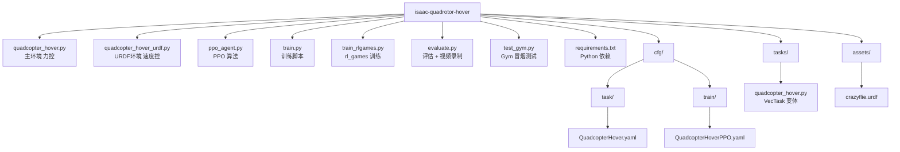

# 四旋翼悬停 — PPO × Isaac Gym

基于 NVIDIA Isaac Gym Preview 4 的四旋翼悬停强化学习项目，使用 PPO 算法训练无人机在目标位置稳定悬停。

## 概述

64 个四旋翼智能体并行训练，每个智能体通过 4 个旋翼推力控制，目标是到达并保持在目标点 `(0, 0, 2)`。整个训练在 GPU 上端到端进行，底层物理引擎为 PhysX。

奖励函数由以下部分组成：
- **位置误差** — 尽量靠近目标点
- **姿态惩罚** — 保持机身水平
- **速度/角速度惩罚** — 飞行平滑稳定
- **动作惩罚** — 旋翼能耗最小化
- **悬停奖励** — 进入目标点 0.15 米范围内给予额外奖励

## 文件说明

| 文件 | 用途 |
|------|------|
| `quadcopter_hover.py` | Isaac Gym 环境（程序化几何体、力控） |
| `quadcopter_hover_urdf.py` | Isaac Gym 环境（Crazyflie URDF、速度控） |
| `ppo_agent.py` | 独立 PPO 实现（Actor-Critic + RolloutBuffer） |
| `train.py` | 训练脚本 —— rollout 收集、PPO 更新、日志、checkpoint |
| `train_rlgames.py` | 训练脚本 —— rl_games 官方 PPO 训练器 |
| `evaluate.py` | 评估脚本 —— 悬停精度、抗扰动恢复、鲁棒性测试、视频录制 |
| `test_gym.py` | 最小化冒烟测试，验证 Isaac Gym 安装是否正常 |
| `requirements.txt` | Python 依赖清单 |
| `assets/crazyflie.urdf` | Crazyflie 2.1 风格四旋翼 URDF 模型 |
| `cfg/task/QuadcopterHover.yaml` | 任务格式配置（VecTask） |
| `cfg/train/QuadcopterHoverPPO.yaml` | rl_games PPO 训练配置 |
| `tasks/quadcopter_hover.py` | 基于 VecTask 基类的环境实现 |

## 环境要求

- **NVIDIA GPU**，支持 CUDA
- **Isaac Gym Preview 4**（[下载地址](https://developer.nvidia.com/isaac-gym)）—— 必须手动安装
- Python 3.8+

```bash
pip install -r requirements.txt
```

> Isaac Gym **无法**通过 pip 安装。请先从 NVIDIA 开发者网站下载，按照官方说明安装后再运行本项目。

## 使用方法

### 1. 冒烟测试

验证 Isaac Gym 是否正常工作：

```bash
python test_gym.py
```

### 2. 训练

```bash
python train.py --sim_device cuda:0 --graphics_device_id -1
```

共训练 1000 轮迭代。每 100 轮保存一次 checkpoint 到 `checkpoints/` 目录，最终模型为 `checkpoints/ppo_final.pt`。训练日志写入 `runs/train_log.csv`。

### 3. 评估

```bash
python evaluate.py --sim_device cuda:0 --graphics_device_id -1 --ckpt checkpoints/ppo_final.pt
```

包含三项测试：
1. **悬停测试** — 无扰动，持续 10 秒
2. **定向扰动** — 从 ±X、±Y 方向施加 20 N 推力，统计恢复时间
3. **随机扰动** — 每 2 秒随机方向扰动，持续 20 秒

## 关键参数

| 参数 | 默认值 | 说明 |
|-----------|---------|-------------|
| `NUM_ENVS` | 64 | 并行环境数量 |
| `TARGET_POS` | (0, 0, 2) | 悬停目标位置（米） |
| `MAX_THRUST` | 0.2 N | 单旋翼最大推力（Crazyflie 级别） |
| `DISTURB_FORCE` | 20.0 N | 扰动力大小 |
| `HOVER_THRESHOLD` | 0.15 m | 判定为"悬停中"的距离阈值 |
| `total_iterations` | 1000 | PPO 训练迭代次数 |
| `lr` | 3e-4 | 学习率 |
| `num_steps` | 16 | 每次 rollout 步数 |
| `num_epochs` | 5 | PPO 更新轮数 |

## 项目结构



## 训练结果（2026-06-12，Seetacloud RTX 4090）

### URDF 力控训练（成功）

Crazyflie URDF 模型 + 刚性体力控，1089 轮完成收敛。

| 指标 | 初始 | 最终 | 最佳 |
|------|------|------|------|
| Reward | 0 | 107,823 | 159,277 |
| Episode Length | 0 | 12,321 步 (123s) | 17,798 步 (178s) |
| Entropy | 3.7 | 7.3 | — |
| FPS | 1,933 | 35,070 | — |

- **训练时间**：~25 分钟（1089 轮 × 32 步 × 1024 环境 / 35k FPS）
- **模型**：`checkpoints/ppo_iter_1000.pt` → 复制为 `checkpoints/ppo_final.pt`
- **关键突破**：第 386 轮 reward 仍为负（-484），第 758 轮跃升至 +681，之后持续收敛

### 技术栈
- **环境**：Isaac Gym Preview 4 + PhysX GPU 管线
- **模型**：Crazyflie 2.1 风格 URDF（base_link + 4 旋翼，5 rigid bodies）
- **控制**：力控模式 —— 直接对旋翼 rigid body 施加 Z 轴推力（0~0.2 N / 旋翼）
- **算法**：自实现 PPO（GAE、value clipping、entropy bonus）
- **域随机化**：质量 ±20%、推力系数 ±15%

### 已知问题与教训
- **DOF 速度控制不适用**：PhysX 刚体引擎不模拟螺旋桨空气动力学，URDF revolute 关节旋转不产生推力。必须使用力控
- **`set_rigid_body_state_tensor` 不可用**：此版本 Isaac Gym 的 GPU PhysX 管线未实现该 API，需用 `set_actor_root_state_tensor`
- **`acquire_actor_rigid_body_properties_tensor` 不存在**：需使用 per-actor `get_actor_rigid_body_properties` / `set_actor_rigid_body_properties`
- **nohup 输出缓冲**：需 `python -u` 标志关闭缓冲

### 服务器环境参考
- 平台：AutoDL，PyTorch 2.0.0 + Python 3.8 + CUDA 11.8，RTX 4090 (24GB)
- Isaac Gym：`/root/isaacgym/`，isaacgymenvs：`/root/IsaacGymEnvs/`
- Python：`/root/miniconda3/bin/python`（非交互 SSH 需完整路径 + `/root/miniconda3/bin/` 在 PATH 中）
- NumPy 必须锁在 `1.23.5`
- **`import isaacgym` 必须在 `import torch` 之前**
