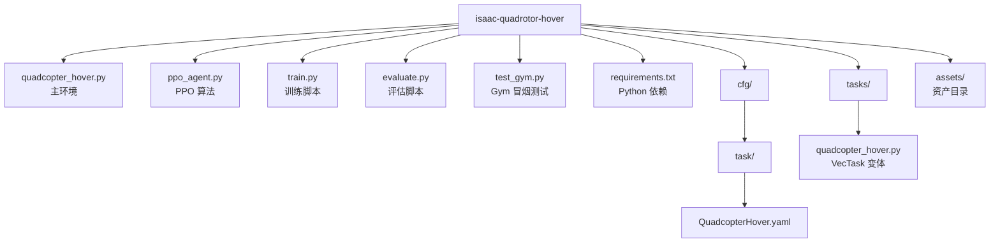

# 四旋翼悬停 — PPO × Isaac Gym

基于 NVIDIA Isaac Gym Preview 4 的四旋翼悬停强化学习项目，使用 PPO 算法训练无人机在目标位置稳定悬停。

## 概述

64 个四旋翼智能体并行训练，每个智能体通过 4 个旋翼推力控制，目标是到达并保持在目标点 `(0, 0, 2)`。整个训练在 GPU 上端到端进行，底层物理引擎为 PhysX。

奖励函数由以下部分组成：
- **位置误差** — 尽量靠近目标点
- **姿态惩罚** — 保持机身水平
- **速度/角速度惩罚** — 飞行平滑稳定
- **动作惩罚** — 旋翼能耗最小化
- **悬停奖励** — 进入目标点 0.15 米范围内给予额外奖励

## 文件说明

| 文件 | 用途 |
|------|------|
| `quadcopter_hover.py` | Isaac Gym 环境 —— 仿真、智能体、物理、奖励 |
| `ppo_agent.py` | 独立 PPO 实现（Actor-Critic + RolloutBuffer） |
| `train.py` | 训练脚本 —— rollout 收集、PPO 更新、日志、checkpoint |
| `evaluate.py` | 评估脚本 —— 悬停精度、抗扰动恢复、鲁棒性测试 |
| `test_gym.py` | 最小化冒烟测试，验证 Isaac Gym 安装是否正常 |
| `requirements.txt` | Python 依赖清单 |
| `cfg/task/QuadcopterHover.yaml` | Isaac Gym 任务格式配置 |
| `tasks/quadcopter_hover.py` | 基于 VecTask 基类的另一种环境实现 |

## 环境要求

- **NVIDIA GPU**，支持 CUDA
- **Isaac Gym Preview 4**（[下载地址](https://developer.nvidia.com/isaac-gym)）—— 必须手动安装
- Python 3.8+

```bash
pip install -r requirements.txt
```

> Isaac Gym **无法**通过 pip 安装。请先从 NVIDIA 开发者网站下载，按照官方说明安装后再运行本项目。

## 使用方法

### 1. 冒烟测试

验证 Isaac Gym 是否正常工作：

```bash
python test_gym.py
```

### 2. 训练

```bash
python train.py --sim_device cuda:0 --graphics_device_id -1
```

共训练 1000 轮迭代。每 100 轮保存一次 checkpoint 到 `checkpoints/` 目录，最终模型为 `checkpoints/ppo_final.pt`。训练日志写入 `runs/train_log.csv`。

### 3. 评估

```bash
python evaluate.py --sim_device cuda:0 --graphics_device_id -1 --ckpt checkpoints/ppo_final.pt
```

包含三项测试：
1. **悬停测试** — 无扰动，持续 10 秒
2. **定向扰动** — 从 ±X、±Y 方向施加 20 N 推力，统计恢复时间
3. **随机扰动** — 每 2 秒随机方向扰动，持续 20 秒

## 关键参数

| 参数 | 默认值 | 说明 |
|-----------|---------|-------------|
| `NUM_ENVS` | 64 | 并行环境数量 |
| `TARGET_POS` | (0, 0, 2) | 悬停目标位置（米） |
| `MAX_THRUST` | 5.0 N | 单旋翼最大推力 |
| `DISTURB_FORCE` | 20.0 N | 扰动力大小 |
| `HOVER_THRESHOLD` | 0.15 m | 判定为"悬停中"的距离阈值 |
| `total_iterations` | 1000 | PPO 训练迭代次数 |
| `lr` | 3e-4 | 学习率 |
| `num_steps` | 16 | 每次 rollout 步数 |
| `num_epochs` | 5 | PPO 更新轮数 |

## 项目结构



## 当前状态（截至 2026-05-30）

### 已完成
- Isaac Gym 仿真环境搭建完毕，程序化几何体构建四旋翼模型
- 64 并行环境，GPU PhysX 加速
- PPO 算法完整实现（GAE、clip、value clipping）
- 训练流程：自动日志（CSV）、定期 checkpoint
- 评估流程：悬停精度、定向扰动恢复、随机扰动鲁棒性三项测试
- 奖励函数已完善（位置 + 姿态 + 速度 + 角速度 + 动作惩罚 + 悬停奖励）

### 待完成（给 AI 的后续任务）

1. **实际训练** — 当前只有代码框架，尚未在 GPU 服务器上跑完整训练。在有 Isaac Gym 的机器上执行 `python train.py --sim_device cuda:0 --graphics_device_id -1`，训练完成后模型保存至 `checkpoints/ppo_final.pt`

2. **调参** — `train.py` 的 `CONFIG` 字典里所有超参数可调。关键参数：`total_iterations`（训练轮数）、`lr`（学习率）、`num_steps`（rollout 步数）、`num_envs`（并行环境数，4090 可开到 4096）

3. **替换为真实 URDF 模型** — 当前四旋翼用 `create_box` / `create_capsule` 程序化搭建，可替换为 Crazyflie 等真实无人机 URDF，放入 `assets/` 目录，修改 `quadcopter_hover.py` 中的资产创建部分

4. **接入 rl_games 库** — `tasks/quadcopter_hover.py` 是按 `isaacgymenvs` 的 `VecTask` 基类实现的环境变体，可配合官方 rl_games PPO 训练器使用（路径通常在 `/root/IsaacGymEnvs/rl_games`）

5. **域随机化** — 对质量、惯量、推力系数等物理参数做随机化，为 Sim2Real 迁移做准备

6. **录制视频** — 训练完成后用 evaluate 模式录制悬停和抗扰动视频

### 服务器环境参考
- 平台：AutoDL，镜像 PyTorch 2.0.0 + Python 3.8 + CUDA 11.8，GPU RTX 4090
- Isaac Gym 安装路径：`/root/isaacgym/`，需手动 `pip install -e .`
- isaacgymenvs（含 rl_games）：`/root/IsaacGymEnvs/`
- NumPy 必须锁在 `1.23.5`，1.24+ 不兼容
- 导入顺序：`import isaacgym` 必须在 `import torch` 之前
